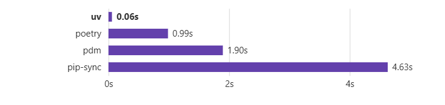

# UV

## Highlights
🚀 A single tool to replace pip, pip-tools, pipx, poetry, pyenv, twine, virtualenv, and more.  
- ⚡️ 10-100x faster than pip.  
- 🗂️ Provides comprehensive project management, with a universal lockfile.  
- ❇️ Runs scripts, with support for inline dependency metadata.  
- 🐍 Installs and manages Python versions.  
- 🛠️ Runs and installs tools published as Python packages.  
- 🔩 Includes a pip-compatible interface for a performance boost with a familiar CLI.  
- 🏢 Supports Cargo-style workspaces for scalable projects.  
- 💾 Disk-space efficient, with a global cache for dependency deduplication.  
- ⏬ Installable without Rust or Python via curl or pip.  
- 🖥️ Supports macOS, Linux, and Windows.  

uv is backed by Astral, the creators of Ruff.

## Installation
Install uv with our official standalone installer:

### macOS and Linux:
```bash
curl -LsSf https://astral.sh/uv/install.sh | sh
```
### Windows:
```bash
powershell -ExecutionPolicy ByPass -c "irm https://astral.sh/uv/install.ps1 | iex"
```
### Simple Application Setup
```bash
uv init my_project
```
- This command creates a basic Python application.
- It includes a simple script that you can run directly.

# Project structure:
my_project/
├── README.md
├── main.py
└── pyproject.toml
---

# Features:
- main.py is a simple script that runs directly.
- pyproject.toml has basic project info but no special build or packaging setup.
- There is no src folder — code is in the main project folder.

# Use case:
- Good for small projects or scripts that you want to run directly.
- Not designed for sharing as a library or package.

### Packaged Application Setup
```bash
uv init --package my_project
```
- This command creates a Python project designed to be packaged and shared (for example, uploaded to PyPI).
- The code is organized inside a src/ folder.


# Project structure:
my_project/
├── README.md
├── pyproject.toml
└── src/
    └── my_project/
        └── __init__.py
---

# Features:
- Code is inside src/ folder — this is a good practice for bigger projects.
- __init__.py tells Python this folder is a package.
- pyproject.toml includes setup for building and packaging your project.

# Example of pyproject.toml build system part:
toml
Copy
[build-system]
requires = ["hatchling"]
build-backend = "hatchling.build"

# Use case:
- Suitable for libraries or packages you want to share with others.
- Prepares your project for distribution.

# Key features that make UV stand out:
- Lightning-fast package installation and dependency resolution
- Compatible with existing Python tools and workflows
- Built-in virtual environment management
- Support for modern packaging standards
- Reliable dependency locking and reproducible environments
- Memory-efficient operation, especially for large projects


## 👨‍💻 Author

-  **Shahid Ali**
- A passionate full-stack developer and learner at **PIAIC** & **GIAIC**
  Feel free to connect or reach out for collaboration!

---


**Happy Coding!** 😎
